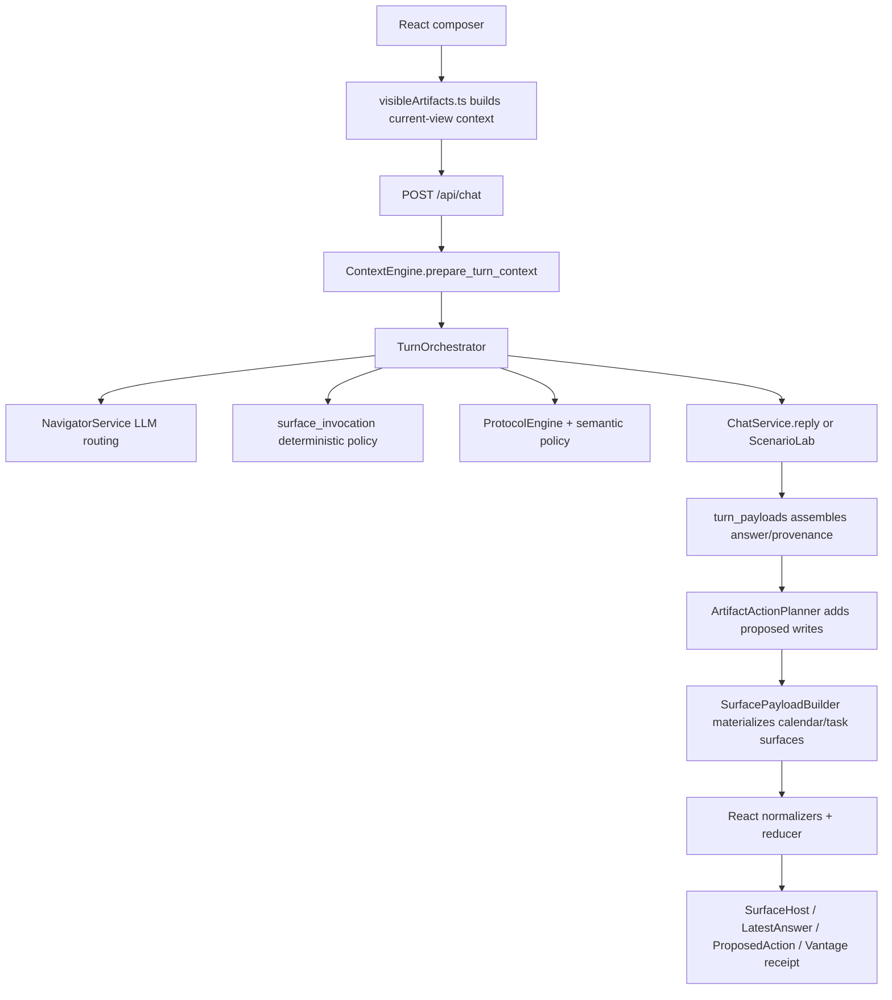
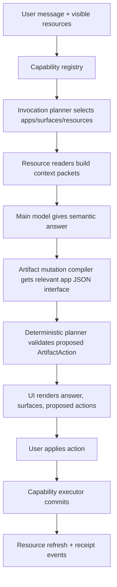

# Vantage Capability Interface Map

> Status: Historical rationale
> Current source of truth: [docs/architecture-overview.md](architecture-overview.md)
> Note: This is an exploratory read-only synthesis of capability-interface patterns. It may inform future architecture work, but it does not define current routing, payload, storage, or frontend contracts.

Date: 2026-05-14

This note consolidates a read-only review of how information flows through Vantage and where the codebase is already converging on an MCP-like application interface.

## Core Finding

Vantage is not really "chat plus panels." It is becoming a capability runtime:

1. Detect what the user is trying to do.
2. Decide which app/context surface should be present.
3. Read the relevant resource into UI and model context.
4. Let the model answer against current visible state.
5. Convert concrete changes into proposed actions.
6. Commit only through deterministic validators/executors.
7. Explain the decision in Vantage/Inspect.

Calendar, tasks, whiteboard, protocols, Scenario Lab, memory, and draft artifacts all repeat this shape, but each one currently implements its part of the lifecycle in a slightly different place.

## Current Chat Turn Flow



Primary backend entry points:

- `src/vantage_v5/server.py`: HTTP edge, per-user providers, `/api/chat`, artifact-action accept/reject.
- `src/vantage_v5/services/context_engine.py`: request/context normalization, active workspace, pinned context, visible artifacts.
- `src/vantage_v5/services/turn_orchestrator.py`: turn ordering and policy composition.
- `src/vantage_v5/services/chat.py`: main answer generation, memory search/vetting, protocol guidance, whiteboard output parsing.
- `src/vantage_v5/services/surface_invocation.py`: deterministic "when to use which app" policy.
- `src/vantage_v5/services/surface_payloads.py`: calendar/task read-model payloads for UI and model context.
- `src/vantage_v5/services/artifact_actions.py`: staged, confirmable calendar/task writes.

Primary frontend entry points:

- `src/vantage_v5/webapp_react/src/App.tsx`: submits chat, applies/rejects actions, handles calendar week navigation.
- `src/vantage_v5/webapp_react/src/appReducer.ts`: persists active artifact view and latest turn state.
- `src/vantage_v5/webapp_react/src/visibleArtifacts.ts`: turns visible surfaces/whiteboard into model-facing context.
- `src/vantage_v5/webapp_react/src/normalizers.ts`: maps backend payloads to typed frontend state.
- `src/vantage_v5/webapp_react/src/components/Surfaces.tsx`: renders active artifact surfaces.
- `src/vantage_v5/webapp_react/src/inspectionModel.ts`: builds the "Why this answer?" receipt.

## Existing Contracts

### Turn Request

`ChatRequest` and `ChatTurnRequestContext` carry the user's message plus continuity state:

- `message`
- `history`
- `workspace_id`, `workspace_scope`, `workspace_content`
- `whiteboard_mode`
- `pinned_context_id`
- `visible_artifacts`
- navigation / pending workspace update state

This is already close to a generic MCP client request: "here is my current visible resource set; decide what to do next."

### Surface Invocation

`SurfaceInvocation` is the closest existing "when to use an app" interface.

It includes:

- `intent`
- `primary_surface`
- `supporting_surfaces`
- `surfaces[]` with kind, role, reason, status
- `write_behavior`
- `confidence`
- `whiteboard_mode`
- `requires_confirmation`

This answers: "what application should Vantage summon and why?"

### Surface Payload

`SurfacePayloadBuilder` materializes operational surfaces:

- `calendar_day`
- `calendar_week`
- `task_focus`
- composite `today_briefing`

Each payload has:

- `id`
- `kind`
- `title`
- `summary`
- `source_refs`
- structured `data`

This answers: "what resource did Vantage read, and what should the UI/model see?"

### Artifact Action

`ArtifactAction` is the staged write interface:

- `id`
- `artifact_kind`
- `operation`
- `status`
- `summary`
- `target_refs`
- `payload`
- `preview`
- `warnings`
- `requires_confirmation`
- `source_refs`
- `origin_user_message`

Calendar and tasks now share this contract. Accept/reject endpoints commit or discard the proposal.

### Visible Artifact

The frontend sends the active visible surface back to the model as:

- `id`
- `kind`
- `title`
- `summary`
- `content` as markdown
- `data` as structured JSON

This is the feedback loop that lets the LLM understand the current user view.

## Capability Comparison

| Capability | Invocation | Read Resource | Visible Context | Write Path | Receipt |
|---|---|---|---|---|---|
| Calendar | `surface_invocation.py` | `calendar.py` + `surface_payloads.py` | `visibleArtifacts.ts` markdown + data | `artifact_actions.py` proposal, provider executor | surface invocation + action |
| Tasks | `surface_invocation.py` | `tasks.py` + `surface_payloads.py` | `visibleArtifacts.ts` markdown + data | `artifact_actions.py` proposal, provider executor | surface invocation + action |
| Today Briefing | schedule/day policy | calendar + tasks composite | visible artifact | no direct write, supporting actions possible | surface invocation |
| Whiteboard | whiteboard routing + durable-artifact policy | workspace store | visible whiteboard content | workspace update/save/publish endpoints | workspace update / draft writes |
| Protocols | protocol engine | protocol catalog / memory-like records | included in prompt, not rendered as app | protocol write path | protocol guidance / learned records |
| Scenario Lab | navigator mode | scenario service/workspaces | branch workspaces | scenario-specific writes | scenario result payload |
| Memory | context/search/vetting | memory/concept/artifact stores | recall cards/context budget | meta action / learned records | memory trace / learned items |

The asymmetry is the main architectural pressure: calendar/tasks are "applications with resources and tools"; whiteboard/protocols/scenario/memory are still partly special-case flows.

## Repeated Pattern

Across navigator controls, protocols, whiteboard drafts, artifact actions, and surface invocation, the code repeats:

1. Model or deterministic policy identifies an intent.
2. A typed object represents what should happen.
3. A deterministic stabilizer validates/sanitizes it.
4. A domain-specific reader/executor runs.
5. The result is translated back into the turn payload.
6. Inspect reconstructs why it happened.

This is the core logic that should become a reusable capability interface.

## Friction Points

1. App knowledge is scattered.

   Adding one new app/surface requires coordinated edits in backend policy, payload builder, action planner, frontend type union, renderer, visible-context serializer, normalizer, labels, and Inspect.

2. `write_behavior` is descriptive, not authoritative.

   Real write safety lives in providers and executors. The policy can say `proposal_only`, but provider `writable` is the source of truth.

3. Surface source refs do not fully reflect capability.

   `SurfacePayloadBuilder._source_refs()` currently hardcodes `read_only: True` for calendar/task refs even when the provider source is writable. Provider `source_status()` is more accurate.

4. Whiteboard is powerful but parallel.

   It behaves like an application, but it does not use `ArtifactAction`. It has `workspace_update`, `/api/workspace`, save snapshots, and promote/publish. Those should eventually become whiteboard tools under the same proposal/execution/audit model.

5. Inspect is partly backend truth and partly frontend inference.

   `inspectionModel.ts` reconstructs context, surfaces, not-opened candidates, and write summaries. This is useful, but the backend should emit more product-facing provenance events so Inspect does less guessing.

6. Model-task calls repeat.

   Navigator, protocol interpreter, vetting, verifier, normalizer, and main answer generation all do versions of: build JSON payload, send instructions/schema, parse result, stabilize.

## Proposed App Capability Contract

Implemented first slice: `src/vantage_v5/services/capabilities.py` now emits a manifest for calendar, tasks, and whiteboard. The manifest is attached to `/api/chat`, `/api/health`, artifact action accept/reject responses, and `system_state`.

The current manifest includes:

- `apps`: product-facing summaries, invocation policy, and write behavior.
- `resources`: `calendar.day`, `calendar.week`, `tasks.focus`, and `whiteboard.active`.
- `tools`: read tools plus confirmable write tools such as `calendar.create_event`, `calendar.replace_event`, `tasks.create_task`, and `tasks.complete_task`.
- `surfaces`: renderer metadata for `calendar_day`, `calendar_week`, `today_briefing`, `task_focus`, and `whiteboard`.
- per-app `json_interface`: the second-step mutation compiler contract for turning semantic intent into Vantage-shaped action JSON.
- `receipt_events`: basic capability registration events for Vantage/Inspect to build on.

Important split: the main chat model does not receive heavy mutation schemas and should not emit tool/action JSON. It receives visible artifact context and a lightweight capability overview, then responds semantically in normal language. If the turn implies an artifact mutation, `src/vantage_v5/services/artifact_mutation_compiler.py` runs as the second step with the relevant app `json_interface`, visible artifact data, the user message, and the semantic response. That compiler produces a proposed `ArtifactAction`, which is still committed only after Apply.

The frontend now has `src/vantage_v5/webapp_react/src/capabilities.ts`, which centralizes surface labels, artifact-action labels, and visible-context Markdown serialization.

Longer term, this should become a backend registry where every application exposes the same primitives.

```python
@dataclass(frozen=True)
class AppCapability:
    app: str
    label: str
    surface_kinds: tuple[str, ...]
    resources: tuple[ResourceDescriptor, ...]
    tools: tuple[ToolDescriptor, ...]
    invocation: InvocationDescriptor
    visible_context: VisibleContextDescriptor
    receipt: ReceiptDescriptor

@dataclass(frozen=True)
class ResourceDescriptor:
    name: str
    uri_template: str
    read_schema: dict
    source_status: Callable[..., dict]
    read: Callable[..., ResourcePayload]

@dataclass(frozen=True)
class ToolDescriptor:
    name: str
    operation: str
    input_schema: dict
    preview: Callable[..., ActionPreview]
    validate: Callable[..., ValidationResult]
    execute: Callable[..., ActionResult]
    requires_confirmation: bool = True
    destructive: bool = False
```

A calendar capability could expose:

- resources: `calendar.day`, `calendar.week`
- tools: `calendar.create_event`, `calendar.update_event`, `calendar.move_event`, `calendar.replace_event`, `calendar.cancel_event`
- surfaces: `calendar_day`, `calendar_week`, `today_briefing`

A task capability could expose:

- resources: `tasks.focus`
- tools: `tasks.create_task`, `tasks.update_task`, `tasks.complete_task`
- surfaces: `task_focus`, `today_briefing`

A whiteboard capability could expose:

- resources: `whiteboard.active`, `whiteboard.snapshot`
- tools: `whiteboard.open`, `whiteboard.update_draft`, `whiteboard.save_snapshot`, `whiteboard.publish_artifact`
- surfaces: `whiteboard`, `draft`

Protocols could become resources/tools too:

- resources: `protocol.email`, `protocol.research_paper`, `protocol.scenario_lab`
- tools: `protocol.apply`, `protocol.update`, `protocol.create`

This mirrors MCP's split between resources and tools:

- Resource: what the LLM can inspect.
- Tool: what the LLM can propose/request.
- Policy: when Vantage should bring the capability into the room.
- Executor: deterministic commit boundary.

## Proposed Unified Turn Pipeline



## What The LLM Should Receive

The main chat model should receive current visible resources and a lightweight capability overview:

```json
{
  "active_resources": [
    {
      "uri": "calendar://day/2026-05-14",
      "kind": "calendar_day",
      "title": "Calendar Day",
      "content": "Markdown summary...",
      "data": {},
      "source_refs": [],
      "capabilities": ["calendar.update_event", "calendar.create_event"],
      "writable": true,
      "write_mode": "proposal_only"
    }
  ],
  "available_tools": [
    {
      "name": "calendar.create_event",
      "description": "Create a user-local calendar event after confirmation.",
      "requires_confirmation": true,
      "input_schema": {}
    }
  ]
}
```

The main model does not need raw mutation schemas. It needs:

- what is visible now
- what resources are relevant
- what tools exist
- what writes require confirmation
- what is read-only
- what assumptions or date resolution are in effect

The second-step artifact mutation compiler receives the app JSON interface:

```json
{
  "step": "artifact_mutation_compiler",
  "apps": [
    {
      "id": "calendar",
      "json_interface": {
        "artifact_kind": "calendar",
        "operations": ["create_event", "replace_event", "move_event"],
        "commit_boundary": "Return a proposed ArtifactAction only. Calendar JSON is mutated only after Apply."
      }
    }
  ],
  "tools": [
    {
      "name": "calendar.replace_event",
      "requires_confirmation": true,
      "status": "available"
    }
  ]
}
```

## Frontend Registry Mirror

The React app should have a matching surface registry:

```ts
type SurfaceCapability = {
  kind: SurfaceKind;
  label: string;
  render: (surface: SurfacePayload) => ReactNode;
  toVisibleArtifact: (surface: SurfacePayload) => VisibleArtifact;
  inspect: (surface: SurfacePayload) => InspectionContextItem[];
  navigation?: SurfaceNavigationHandlers;
};
```

This would remove hardcoded switch logic from:

- `Surfaces.tsx`
- `visibleArtifacts.ts`
- `inspectionModel.ts`
- `App.tsx` calendar-week wrapping
- action labels in `Core.tsx` and `App.tsx`

## Incremental Implementation Plan

1. Add read-only capability descriptors.

   Create `src/vantage_v5/services/capabilities.py` with descriptors for calendar, tasks, and whiteboard. Do not change behavior yet.

2. Generate manifests from descriptors.

   Expose capability metadata to `safe_system_state`, surface invocation receipts, and model context.

3. Move surface source refs to provider truth.

   Replace hardcoded `read_only: True` in `surface_payloads.py` with provider `source_status()`.

4. Refactor visible-resource handling.

   Unify `visible_artifacts`, active surfaces, and whiteboard into one `VisibleResource` envelope with URI/kind/content/data/mutable fields.

5. Put calendar/tasks action planning behind tool descriptors.

   Keep `ArtifactAction` as the wire format, but derive supported operations, schemas, confirmation policy, and executor lookup from the registry.

6. Bring whiteboard into the same action model.

   Convert save/publish/update draft into capability tools while preserving the existing UI and endpoints.

7. Make Inspect consume receipt events.

   Backend emits `receipt_events`: invocation selected, resource read, model context included, action proposed, action accepted/rejected, resource refreshed. Frontend renders those events instead of inferring as much.

8. Collapse repeated model JSON calls behind a `ModelTask` helper.

   Use one helper for navigator, protocol interpreter, vetting, verifier, and normalizer. This reduces protocol drift and makes tool/capability prompting consistent.

## Recommended North Star

Vantage should treat each "application" as a capability bundle:

- Invocation policy: when should this app appear?
- Resource readers: what can the LLM/user inspect?
- Tool/action descriptors: what can be changed?
- Confirmation policy: what needs Apply?
- Executor: how deterministic writes happen.
- Surface renderer: how the user sees it.
- Visible-context serializer: what goes back into the next turn.
- Receipt events: how Vantage explains the decision.

That keeps the product feeling like Jarvis while making the codebase less like a pile of separate protocols.
